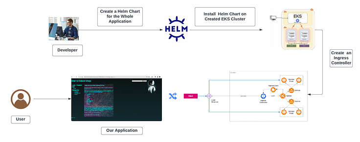

# 🛒 Deploy de Aplicação E-Commerce Three-Tier na AWS EKS com Terraform e Helm



---

# 📌 Sobre o Projeto

Este projeto demonstra o provisionamento completo de uma arquitetura **Three-Tier (3 Camadas)** na AWS utilizando **Terraform** para criação da infraestrutura e **Helm** para deploy da aplicação em um cluster Amazon EKS.

A solução simula um ambiente real de produção para uma aplicação E-Commerce baseada em microsserviços, incluindo:

- Cluster Kubernetes gerenciado (EKS)
- Ingress com Application Load Balancer
- Provisionamento dinâmico de volumes via EBS CSI
- Deploy automatizado via Helm Chart
- Arquitetura altamente disponível e escalável

O objetivo é demonstrar práticas modernas de **Infraestrutura como Código (IaC)** combinadas com orquestração de containers.

---

# 🏗️ Arquitetura da Solução

A aplicação segue o modelo clássico **Three-Tier Architecture**:

## 🔹 1️⃣ Presentation Layer
- Interface Web da aplicação
- Exposta via Ingress (ALB)
- Comunicação HTTP/HTTPS

## 🔹 2️⃣ Application Layer
- Microsserviços executando no EKS
- Pods distribuídos em múltiplas AZs
- Escalabilidade horizontal

## 🔹 3️⃣ Data Layer
- Bancos de dados internos
- Persistência via Amazon EBS
- Provisionamento dinâmico com CSI Driver

---

# 🧠 Decisões Arquiteturais

- Uso de Terraform para provisionamento completo do EKS
- Infraestrutura modular e reutilizável
- Cluster distribuído em múltiplas Availability Zones
- IAM Roles for Service Accounts (IRSA)
- ALB Controller para Ingress gerenciado
- EBS CSI Driver para armazenamento persistente
- Deploy desacoplado via Helm Chart
- Separação clara entre infraestrutura e aplicação

---

# ⚙️ Stack Tecnológica

- AWS EKS
- AWS VPC
- EC2 Managed Node Groups
- IAM (IRSA)
- Application Load Balancer
- EBS CSI Driver
- Terraform >= 1.0
- Kubernetes
- Helm
- kubectl
- AWS CLI

---

# 📂 Estrutura de Pastas Recomendada

```
eks-ecommerce-terraform/
├── modules/
│   ├── vpc/
│   ├── eks/
│   ├── iam/
│   └── alb/
├── environments/
│   ├── dev/
│   │   ├── main.tf
│   │   ├── variables.tfvars
│   │   └── backend.tf
│   └── prod/
│       ├── main.tf
│       ├── variables.tfvars
│       └── backend.tf
├── helm/
│   └── robot-shop/
├── ingress/
│   └── ingress.yaml
├── README.md
└── .gitignore
```

---

# 🚀 Provisionamento da Infraestrutura com Terraform

## 1️⃣ Inicializar

```bash
terraform init
```

## 2️⃣ Planejar

```bash
terraform plan -var-file=variables.tfvars
```

## 3️⃣ Aplicar

```bash
terraform apply -var-file=variables.tfvars --auto-approve
```

### Recursos Criados

- VPC com subnets públicas e privadas
- Internet Gateway e NAT Gateway
- Cluster EKS
- Managed Node Group
- IAM Roles e Policies (IRSA)
- OIDC Provider
- Security Groups
- ALB Controller via Helm provider (opcional)
- EBS CSI Add-on

---

# 🔐 Configuração de Add-ons (Via Terraform)

## 🔹 OIDC Provider
Configurado automaticamente via Terraform.

## 🔹 AWS Load Balancer Controller
Instalado via Helm provider do Terraform ou manualmente via Helm.

## 🔹 EBS CSI Driver
Provisionado como add-on oficial do EKS.

---

# 📦 Deploy da Aplicação com Helm

## 1️⃣ Atualizar kubeconfig

```bash
aws eks update-kubeconfig --name <cluster-name> --region <region>
```

## 2️⃣ Criar Namespace

```bash
kubectl create namespace robot-shop
```

## 3️⃣ Instalar Helm Chart

```bash
helm install robot-shop ./helm/robot-shop -n robot-shop
```

---

# 🌐 Configuração do Ingress (ALB)

```bash
kubectl apply -f ingress/ingress.yaml
```

Isso cria automaticamente um **Application Load Balancer** na AWS.

Obtenha o DNS:

```bash
kubectl get ingress -n robot-shop
```

Acesse via navegador utilizando o DNS retornado.

---

# 🔐 Segurança Implementada

- IRSA (IAM Roles for Service Accounts)
- Subnets privadas para Node Groups
- Security Groups restritivos
- TLS suportado via ACM (opcional)
- Separação entre camadas

---

# 📊 Escalabilidade

- Auto Scaling no Node Group
- Escalabilidade horizontal dos pods
- Balanceamento automático via ALB
- Provisionamento dinâmico de storage

---

# 🧹 Destruição da Infraestrutura

```bash
terraform destroy --auto-approve
```

Remove completamente:

- Cluster EKS
- VPC
- Node Groups
- Load Balancer
- IAM Roles
- Recursos associados

---

# 📈 Resultados Técnicos

✔ Arquitetura Three-Tier em Kubernetes  
✔ Infraestrutura 100% como código  
✔ Deploy desacoplado via Helm  
✔ Alta disponibilidade multi-AZ  
✔ Persistência dinâmica com EBS  
✔ Ingress gerenciado com ALB  
✔ Ambiente pronto para produção  

---

# 📚 Aprendizados Aplicados

- Provisionamento de EKS com Terraform
- IRSA e segurança avançada no Kubernetes
- Deploy de microsserviços via Helm
- Integração entre Kubernetes e ALB
- Persistência com CSI Driver
- Arquitetura cloud-native escalável

---

# 🤝 Contribuição

1. Fork do repositório  
2. Criar nova branch  
3. Commit  
4. Push  
5. Pull Request  

---

# ⭐ Se este projeto foi útil

Considere:

- Dar uma estrela ⭐
- Compartilhar com sua rede
- Contribuir com melhorias  

---

> Este projeto demonstra a implementação de uma aplicação Three-Tier moderna em ambiente Kubernetes, com infraestrutura provisionada via Terraform e deploy automatizado via Helm, simulando um cenário real de produção em cloud.
